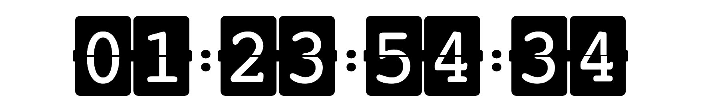

<h1 align="center">
rc-countdown-flip
</h1>



[demo](https://kuckboy1994.github.io/rc-countdown-flip/)

## Install

```bash
yarn add rc-countdown-flip
```

## Basic Usage

```jsx
import FlipCountDown from "rc-countdown-flip";

<FlipCountDown
  option={{
    leftSecond: 100,
    format: "hh:mm:ss",
    end: () => {
      alert("end");
    },
    style: {
      color: "black",
      background: "white"
    },
    standard: "50px"
  }}
/>;
```

## Attribute

| name       | 含义                                 | 默认值                                | 说明                            |
| ---------- | ------------------------------------ | ------------------------------------- | ------------------------------- |
| leftSecond | 剩余时间                             | 0                                     |
| format     | 格式                                 | dd:hh:mm:ss                           | 区分大小写，:是分隔符，可以修改 |
| style      | 样式（只能设置 color 和 background） | {color: 'white', background: 'black'} |
| standard   | 基准大小                             | 100px                                 | 即：高。同比例放大缩小          |

## Method

| name | 含义           | 默认值 |
| ---- | -------------- | ------ |
| end  | 结束的回调方法 |        |

## TIPS

1. 设置样式

样式修改主要用到两个属性 `style` 和 `standard`。  
`style` 只支持 `color` 和 `background`。字面意思。字体颜色和背景，但是分隔符使用的是 `background` 需要注意。

```jsx
<FlipCountDown
  option={{
    leftSecond: 86400 * 2 + 5,
    format: "dd:hh:mm:ss",
    style: {
      color: "#47858b",
      background: "#e4f4f3"
    },
    standard: "80px"
  }}
/>
```

2. format 使用

`format` 默认为 'dd:hh:mm:ss'。  
区分大小写。当使用大写的时候，最大值变成 100，而不是我们常规理解中的小时 24、分钟秒 60 了。主要是为了解决如倒计时 2 天，但不想显示天的，设置 `HH:mm:ss`，会显示为 `48:00:00`。  
_注意_ 当所有的值都设置为 **大写** 的时候，你可以会觉得有些奇怪，看一下我上面说的，最大值为 100，你可能会理解。

```jsx
<FlipCountDown
  option={{
    leftSecond: 86400 * 2 + 5,
    format: "HH:mm:ss"
  }}
/>
```
